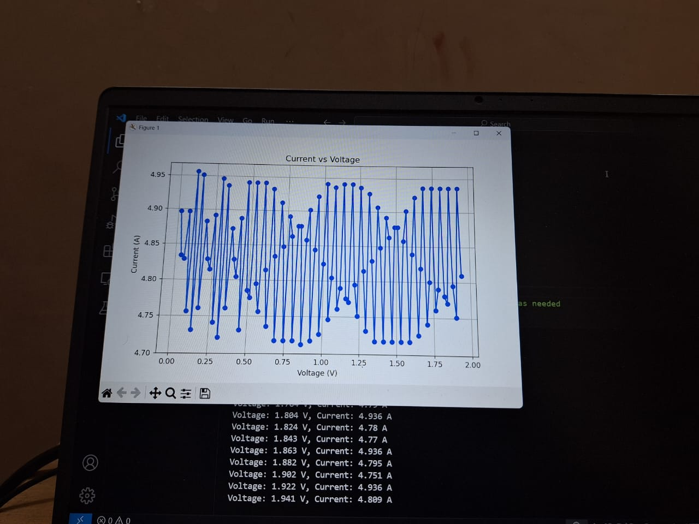

⚡ Arduino-Based Electrochemical Sensor Data Acquisition System

**Turning Chemistry into Digital Insight!**

📌 **Overview**

This project demonstrates an **Arduino-powered data acquisition system** designed for an electrochemical three-electrode sensor, widely used in electrochemical analysis and biosensing. The system allows for real-time monitoring and logging of electrochemical reactions with high precision and portability.

 🔬 **Project Description**

The system integrates:

- A **Potentiostat Circuit** for controlling and measuring electrochemical reactions.
- **Operational Amplifiers (Op-Amps)** for signal amplification.
- An **Arduino Microcontroller** for digitizing and processing the analog output from the sensor.

The sensor’s analog signals are converted to digital values using Arduino’s ADC and can be logged, visualized, or exported for deeper analysis via software like **MATLAB**, **Python**, or **Excel**.

💡 **Key Features**

- 🧪 Real-time monitoring of electrochemical reactions.
- ⚙️ Amplified, low-noise signal handling.
- 💾 Data logging to PC or external storage.
- 💻 Compatible with MATLAB, Python, and Excel for advanced analysis.
- 💸 Low-cost, portable, and easy-to-build system.

🎥 **Watch the System in Action**

🧪 Arduino-Based Data Acquisition Circuit for Electrochemical Sensor — Assembly Guide

This guide outlines the procedure for building an **Arduino-based data acquisition circuit** specifically designed for an **electrochemical three-electrode sensor system**. The setup is ideal for beginners, researchers, and enthusiasts who want a low-cost and customizable data logging solution for electrochemical experiments.

⚡ Components Required:

- Arduino Uno (or compatible board)
- Electrochemical three-electrode sensor (Working, Reference, Counter electrodes)
- Operational Amplifier (Op-Amp) — e.g., LM324 or LM358
- Resistors (as per required feedback and biasing)
- Capacitors (for noise filtering)
- Jumper Wires
- Breadboard or PCB
- Power supply (5V from Arduino or external if needed)
- Computer with Arduino IDE installed
- Serial Plotter / Logger software (optional)

🔧 Circuit Assembly Procedure:

1. **Setting Up the Op-Amp Circuit:**
    - Connect the **working electrode (WE)**, **reference electrode (RE)**, and **counter electrode (CE)** of the electrochemical sensor to the input terminals of the op-amp circuit.
    - Design your op-amp configuration based on the measurement requirement:
      - *Potentiostat* for voltage control.
      - *Transimpedance amplifier* for current-to-voltage conversion from the working electrode.
    - Use precision resistors for accurate signal conditioning.

2. **Filtering & Signal Conditioning:**
    - Connect capacitors for noise filtering at the op-amp output if necessary.
    - Use a voltage divider or level shifter if the output exceeds the Arduino’s ADC input range (0-5V for Uno).

3. **Connecting to Arduino:**
    - Wire the op-amp output to one of the **Analog Input pins (A0-A5)** of the Arduino.
    - Ensure all grounds (sensor, op-amp, and Arduino) are connected to establish a common reference.

4. **Powering the Circuit:**
    - The sensor circuit and op-amp can be powered directly from the Arduino's **5V and GND** pins, or an external regulated supply, depending on power demands.

5. **Uploading the Code:**
    - Write and upload an Arduino sketch that:
        - Reads analog data from the ADC pin.
        - Converts the ADC values to meaningful voltage or current readings.
        - Sends the data via Serial to your computer for logging or real-time visualization.

6. **Testing the Setup:**
    - Open the **Serial Monitor** or **Serial Plotter** in Arduino IDE.
    - Observe real-time data from your sensor.
    - Perform calibration as needed depending on your experimental setup.

💡 Notes:

- Make sure the op-amp you select can handle single-supply operation if powered directly from Arduino.
- Use shielding and proper grounding to minimize noise during measurements.
- For higher accuracy, consider using external ADC modules with higher resolution.

 📌 Example Applications:

- Water quality monitoring
- Glucose level detection
- pH or ion-selective measurements
- Electrochemical reaction studies

🚀 **Applications**

- Biosensing (e.g., glucose, dopamine detection)
- Environmental monitoring (e.g., water quality, gas sensors)
- Chemical analysis and laboratory research

⚡ **Getting Started**

1. Connect the electrochemical sensor to the potentiostat circuit.
2. Amplify the signal using Op-Amps.
3. Feed the output into the Arduino’s ADC input pins.
4. Upload the Arduino sketch to process and log the data.
5. Visualize or analyze the data using PC software like MATLAB, Python, or Excel.

🤝 **Contribute**

Have ideas to enhance this project? Found a bug?  
Pull requests and contributions are always welcome!
